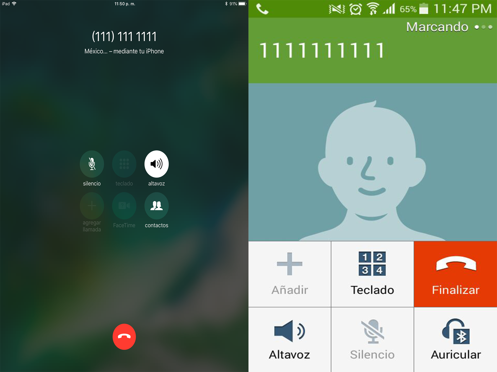
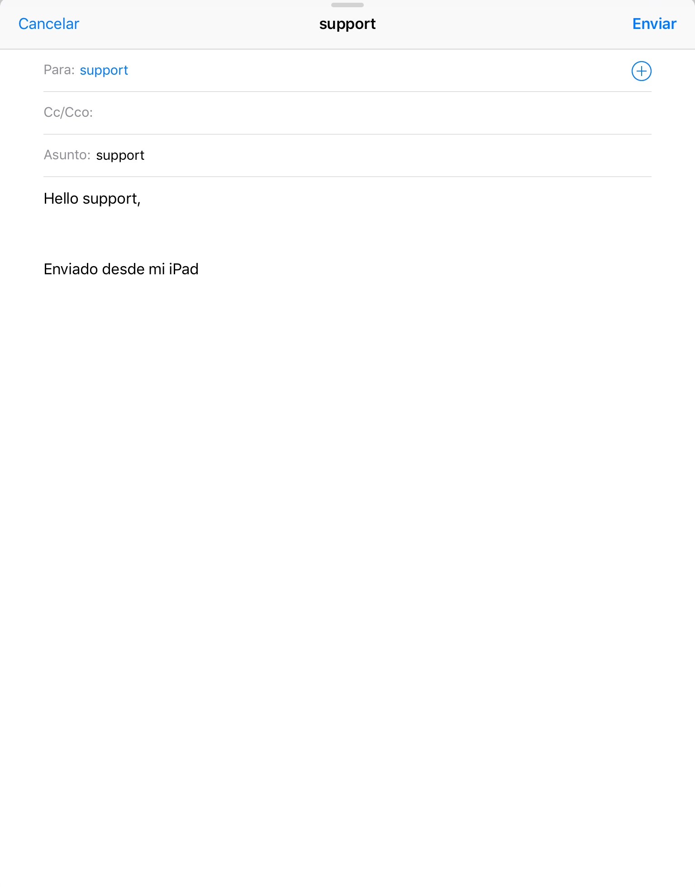

<div align="center">
  
  
</div>
<br>
<div align="center">
  <strong>Initiate a phone call in React Native</strong>
</div>
<br>
<div align="center">
  Built with ❤︎ by <a href="https://github.com/fercho0">Fernando.LC</a>
</div>

<h2>Table of Contents</h2>
<details>
  <summary>Table of Contents</summary>
  <li><a href="#introduction">Introduction</a></li>
  <li><a href="#install">Install</a></li>
  <li><a href="#usage">Usage</a></li>
  <li><a href="#contribute">Contribute</a></li>
  <li><a href="#license">License</a></li>
</details>


## Introduction

This is a small module that allows you to initiate a phone call in React Native. 

## Install

**Install with npm**

```sh
$ npm install --save react-native-call
```

**Install with yarn**

```sh
$ yarn add react-native-call
```

## Usage

To use the module, call the function with an object containing the number to call as a argument.

```js
import { CALL, WEB } from 'react-native-call'

/* example for call */

const CALL_DATA = {
  number: '1111111111', // String value with the number to call
  prompt: false // Optional boolean property. Determines if the user should be prompt prior to the call, for default true.
}

CALL( callCALL_DATAData ).catch( console.error )


To use the module, call the function with an object containing the EMAIL or URL, to call as a argument.

const EMAIL = 'mailto:support?subject=support&body=Hello support,';
const URL = 'https://github.com/fercho0/react-native-call';

WEB( EMAIL ).catch( console.error ); //sending email.
WEB( URL   ).catch( console.error ); //open url on browser.

```

## Contributing

All Contributions are welcome! Please open up an issue if you would like to help out.

## License

Licensed under the [MIT License](https://tiaan.mit-license.org/).